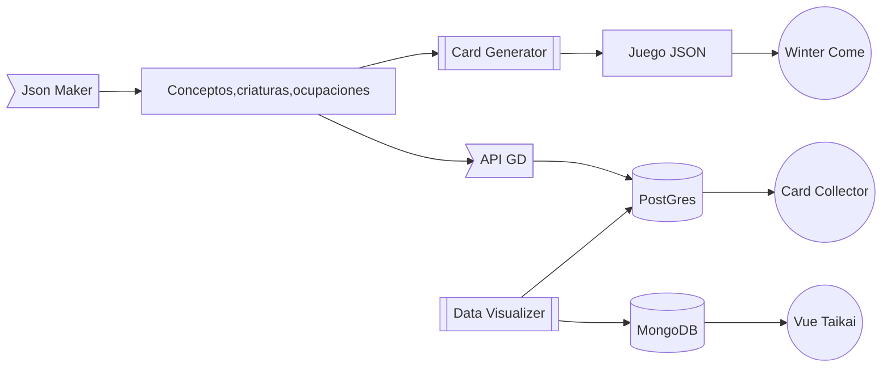
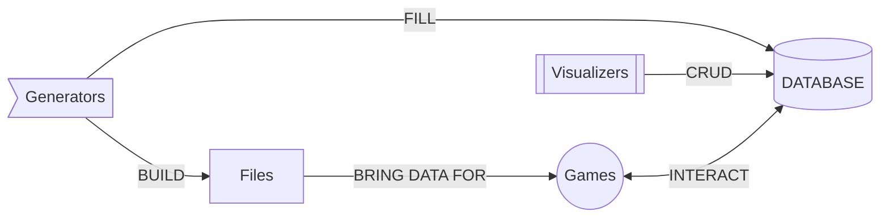

# Gaming Triad
A triad (or more) of game-related proyects in java and python.

## Generators

### Game Design Crud
A Java Springboot application to CRUD a database for a game.

### Json Maker
A simple Java program that generates custom JSON files to use in visualizers and games.

## Data Visualizer

### Card Generator (Like his namesake says is also a Generator)
A Game generator made with python/flask. Uses 3 json that can be made with "Json Maker", to generate random game data for serveral games.
It also has a custom visualization with 2 diferent styles of cards.

## Games

### Winter Come 
A Game of the "Seasons Saga" made with python/flask.
Winter Come is a winter-themed survival concept game. Uses Card Generator files to feed his world.

### Diagram

### References 

